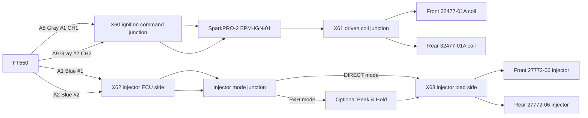

# EPM Physical Connector & Mounting Drawing

## Release status

REV 0.2 - physical architecture frozen; exact OEM coil/injector mating terminal part numbers and final measured branch lengths remain release gates.

## Selected ignition hardware

FuelTech SparkPRO-2 is the project baseline ignition driver because the Turbo V-Rod uses two OEM passive two-terminal 32477-01A coils. SparkPRO-2 provides two independent ignition channels, one per coil. FuelTech specifies one coil per channel and recommends mounting SparkPRO as close as practical to the coils.

Project hardware ID: EPM-IGN-01
Project connector IDs: X60 ignition command interface; X61 driven coil interface.

## Physical layout

## X60 - FT550 to SparkPRO command interface

| Cavity | Circuit | Source | Destination | Provisional conductor | Status |
|---|---|---|---|---|---|
| 1 | IGN_CMD_FRONT | FT550 A8 Gray #1 | SparkPRO CH1 trigger | 0.35 mm2 | FUNCTION FROZEN |
| 2 | IGN_CMD_REAR | FT550 A9 Gray #2 | SparkPRO CH2 trigger | 0.35 mm2 | FUNCTION FROZEN |
| 3 | IGN_SERVICE_GND | EPM ground reference if required by selected harness/manual | SparkPRO interface | VERIFY against SparkPRO harness | GATED |
| 4 | SPARE | - | - | - | RESERVED |

Do not route X60 in the CKP branch.

## X61 - SparkPRO driven coil interface

| Cavity | Circuit | Source | Destination | Status |
|---|---|---|---|---|
| 1 | COIL_DRV_FRONT | SparkPRO CH1 output | Front 32477-01A primary | FUNCTION FROZEN / TERMINAL VERIFY |
| 2 | COIL_DRV_REAR | SparkPRO CH2 output | Rear 32477-01A primary | FUNCTION FROZEN / TERMINAL VERIFY |
| 3 | COIL_PWR_FRONT | EPM protected ignition +12 V | Front coil remaining primary terminal | FUNCTION FROZEN |
| 4 | COIL_PWR_REAR | EPM protected ignition +12 V | Rear coil remaining primary terminal | FUNCTION FROZEN |

Driven primary conductors must be kept short and physically separated from CKP and low-level analogue wiring.

## X62/X63 injector service junction

X62 is the ECU-side two-channel injector command interface. X63 is the engine-side injector interface. The junction accepts exactly one configuration insert.

### DIRECT_DRIVE_APPROVED insert

X62-1 -> X63-1 front injector command
X62-2 -> X63-2 rear injector command

Permitted only after 27772-06 electrical characterization proves direct FT550 compatibility.

### PEAK_HOLD_INSTALLED insert

X62-1 -> X64-1 P&H input front
X62-2 -> X64-2 P&H input rear
X65-1 P&H output front -> X63-1
X65-2 P&H output rear -> X63-2

Peak & Hold current class must be selected from measured injector requirements. Direct jumper and P&H insert must be mechanically mutually exclusive.

## Mounting zone

Preferred EPM module grouping:

1. FT550 mounted in accessible low-heat cockpit/electronics zone.
2. SparkPRO-2 mounted on a rigid metallic heat-spreading bracket as close to the two coils as packaging permits.
3. Injector interface junction mounted beside the FT550/EPM service area, not beside the turbocharger.
4. Optional Peak & Hold module mounted with airflow/thermal clearance and service access.
5. X60/X62 command wiring follows the low-current EPM route.
6. X61 coil-primary wiring leaves the EPM zone on a dedicated ignition branch.
7. CKP B02 remains physically separate from SparkPRO, coil primary and starter wiring.

## Thermal and environmental rules

- No SparkPRO or Peak & Hold module on a turbo/exhaust heat shield.
- Avoid direct radiant line-of-sight to turbine housing and exhaust primaries.
- Provide metallic mounting structure for heat spreading where the manufacturer requires it.
- Do not bury power electronics inside sealed foam or tightly packed loom bundles.
- Maintain drip-loop/service access where connector orientation permits.
- Heat sleeve is required where engine branches pass through turbo/exhaust heat zones.

## Ground and power boundary

SparkPRO/ignition power grounds belong to the EPM power-ground system and must not return through SP-S02 sensor ground. Injector and coil +12 V feeds use dedicated EPM protected branches. The exact SparkPRO power/ground cavities and conductor sizing shall follow the selected FuelTech SparkPRO-2 harness/manual and measured coil current.

## Initial FT550 ignition configuration baseline

FuelTech identifies SparkPRO operation as falling-edge ignition with dwell control. Final dwell values remain measurement/OEM gated. No production calibration shall be released solely from generic example dwell values.

## Release gates

- Verify exact SparkPRO-2 harness/connector pinout and terminal kit.
- Measure/verify 32477-01A primary resistance and current ramp; freeze dwell.
- Identify exact OEM coil mating connector/terminals/seals.
- Measure 27772-06 resistance/current; select DIRECT or Peak & Hold.
- If P&H required, freeze driver current class and connector kit.
- Measure final X60-X65 branch lengths after module positions are physically fixed.
- Perform continuity, insulation, polarity and no-load output tests before connecting coils/injectors.
