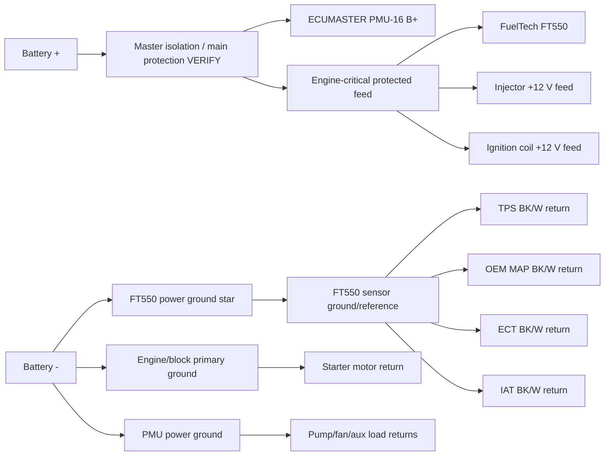

# Sheet 01 - Master Power and Grounds

## Purpose

Define the complete new power backbone for the VRXSE Destroyer using FT550 + ECUMASTER PMU-16 while preserving clean sensor references.

## Power domains

| Domain | Feed source | Loads | Ground strategy |
|---|---|---|---|
| EPM | battery + via master protection and dedicated protected branch | FT550, injectors, ignition coils | FT550/engine-critical returns to controlled star at battery/engine reference |
| APM / PMU | battery + via main protection sized for PMU and total downstream load | pumps, fans, boost-solenoid supply, race auxiliaries | dedicated high-current returns to battery/engine power reference, not sensor return |
| SIM | FT550 sensor references | OEM sensors and low-level inputs | FT550 sensor ground only |

## New harness ground IDs

| ID | Description | Status |
|---|---|---|
| G1 | Battery negative to engine/block heavy cable | DESIGN, size VERIFY |
| G2 | Battery negative to PMU power ground | DESIGN, size VERIFY |
| G3 | FT550 primary power ground to controlled battery/engine star | DESIGN, exact FT550 conductors VERIFY |
| G4 | FT550 sensor ground bus to OEM BK/W sensor returns | DESIGN based on OEM sensor-return principle |
| G5 | Chassis/bond strap if required | VERIFY physical vehicle architecture |

## Isolation rule

G4 is a measurement return, not a general earth. Fuel pumps, fans, coils, injectors, starter and PMU-controlled loads must never terminate on G4.

## Main isolation

The complete new harness shall retain a race-accessible master isolation strategy capable of removing engine-management and PMU-controlled power. The exact master switch/contactor and alternator/regulator handling are `VERIFY` because the charging-system termination is not yet fully recorded in the repository.

## Cranking requirement

The EPM and PMU feeds must be designed so the FT550 remains above its minimum operating voltage during starter engagement. Record battery voltage at FT550 and PMU during cranking as a commissioning acceptance test.
