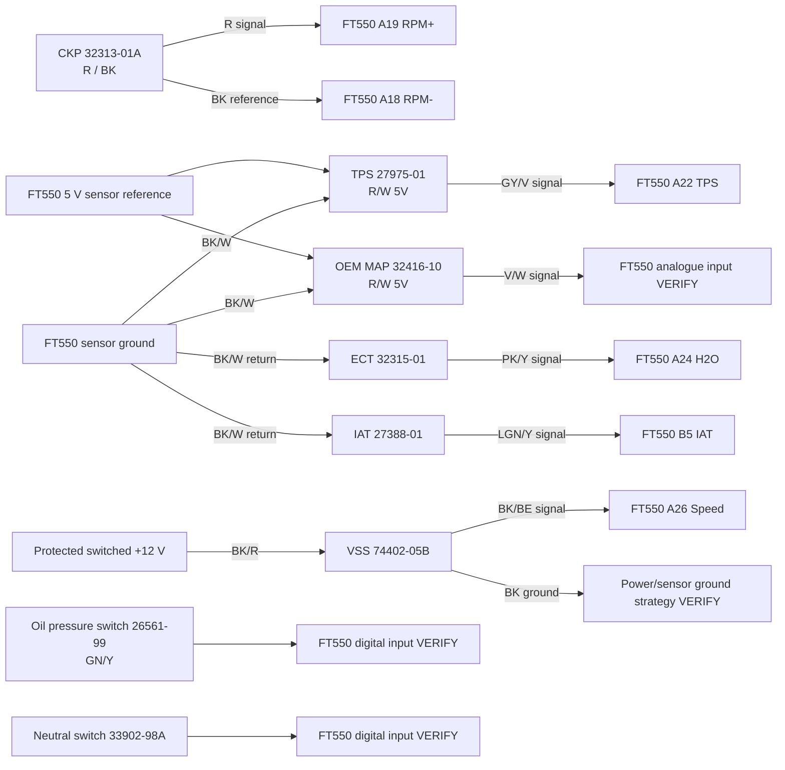

# Sheet 02 - OEM Sensors to FuelTech FT550

## Baseline

Use the original VRXSE/common-VRSC engine sensor hardware identified in this repository. Do not add aftermarket engine sensors to this sheet.

## Sensor termination table

| Function | OEM part | OEM wiring recorded in repo | FT550 destination | Status |
|---|---:|---|---|---|
| CKP | 32313-01A | R + BK, connector [79] | A19 RPM+ / A18 RPM- | VERIFIED working cross-reference; polarity must be scoped |
| TPS | 27975-01 | GY/V signal, R/W 5 V, BK/W return [88] | A22 + FT550 5 V + sensor ground | VERIFIED working cross-reference; calibration VERIFY |
| MAP | 32416-10 | V/W signal, R/W 5 V, BK/W return [80] | FT550 analogue input | DESIGN decision: retain OEM MAP; exact input/calibration VERIFY |
| ECT | 32315-01 | PK/Y signal + BK/W return [90] | A24 | VERIFIED working cross-reference; thermistor curve VERIFY |
| IAT | 27388-01 | LGN/Y signal + BK/W return [89] | B5 | VERIFIED working cross-reference; curve VERIFY |
| VSS | 74402-05B | BK/R +12 V, BK/BE signal, BK ground [65] | A26 | VERIFIED working cross-reference; pulse calibration VERIFY |
| Oil pressure switch | 26561-99 | GN/Y [120] | spare digital input | input pull-up/polarity VERIFY |
| Neutral switch | 33902-98A | connector [131] | spare digital input | switched-ground behaviour VERIFY |
| Cam sync | none identified | none | DNP | crank-only unless later OEM evidence changes baseline |

## OEM MAP policy

For this revision, the original Harley MAP sensor is retained because the project requirement is to use factory sensor hardware. The FT550 internal MAP may remain available as a secondary/reference channel only if plumbing and configuration are later approved. The OEM MAP transfer curve and pressure range must be verified before boost operation.

## CKP routing

Use a dedicated twisted pair from CKP to FT550 A18/A19. Add shield only in accordance with the verified FuelTech/physical-sensor requirement. Route separately from coil primary wiring, spark leads, starter cables, PMU outputs, pump feeds and fan feeds.

## Connector philosophy

Where the OEM sensor connector remains serviceable, retain the mating OEM connector at the component. The new harness begins immediately behind that connector and carries a new project wire ID while preserving the recorded OEM colour at the short sensor pigtail where applicable.
