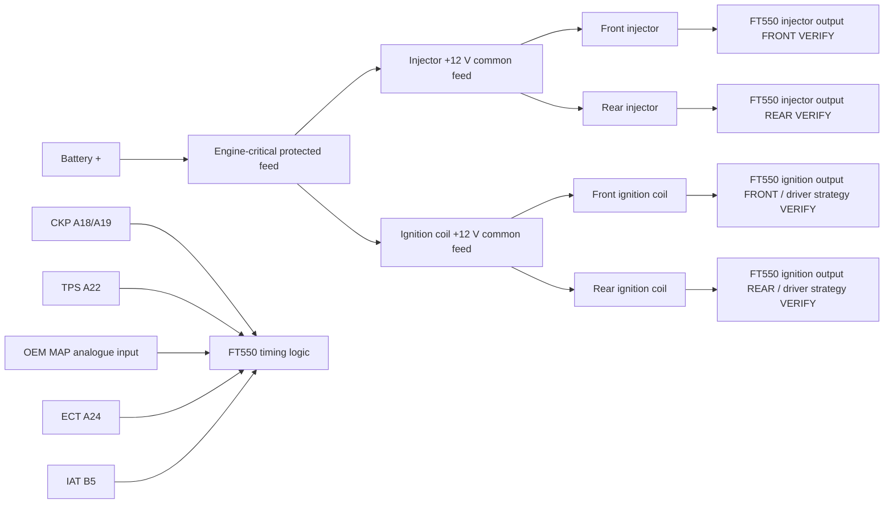

# Sheet 03 - Injection and Ignition

## Purpose

Define the new engine-critical actuator wiring around the FT550 while retaining the original VRXSE engine hardware where practical.

## Engine-critical power philosophy

The injector and ignition +12 V feeds are deliberately kept on a dedicated EPM branch in this revision rather than moving them automatically onto the PMU-16. This prevents a single PMU logic, CAN or configuration fault from necessarily removing every engine-critical load.

The PMU-16 may later supply the EPM master feed if failure-mode testing proves that arrangement superior, but the FT550 control outputs remain direct ECU control paths.

## Injector circuits

| Circuit | Supply | ECU control | Status |
|---|---|---|---|
| Front injector | EPM protected +12 V | FT550 injector output | exact FT550 cavity/wire colour VERIFY |
| Rear injector | EPM protected +12 V | FT550 injector output | exact FT550 cavity/wire colour VERIFY |

Before release, record injector impedance, peak current, steady current, connector cavity, polarity if applicable and FT550 configured injector mode.

## Ignition circuits

| Circuit | Supply | ECU control | Status |
|---|---|---|---|
| Front coil | EPM protected +12 V | FT550 ignition channel / required igniter topology | VERIFY exact OEM coil electrical type and FT550 driver compatibility |
| Rear coil | EPM protected +12 V | FT550 ignition channel / required igniter topology | VERIFY exact OEM coil electrical type and FT550 driver compatibility |

Do not connect an FT550 ignition output to an OEM coil until the coil type and required driver/igniter arrangement are verified from the physical hardware and FuelTech requirements.

## Grounding and routing

Coil and injector current returns must not use the FT550 sensor-ground network. Route ignition primary conductors away from CKP, TPS, MAP, ECT and IAT wiring. If the OEM coil body or secondary system relies on engine grounding, preserve the mechanical ground path and verify resistance to battery negative.

## Trigger dependency

Because no OEM cam sensor is currently identified, this sheet assumes crank-only engine-position information. Final injection/ignition phasing strategy is therefore configuration-dependent and remains `VERIFY` until the FT550 trigger setup is validated with a scope and timing light.
