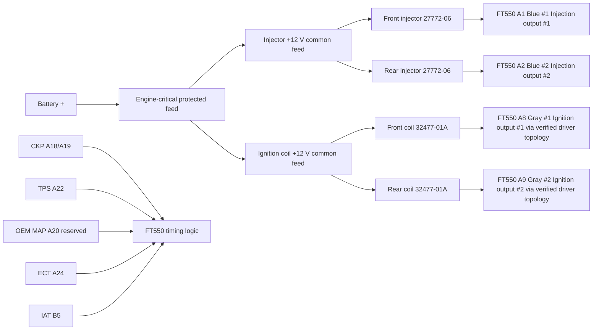

# Sheet 03 - Injection and Ignition

## Purpose

Define the new engine-critical actuator wiring around the FT550 while retaining the original VRXSE engine hardware where practical.

## Manufacturer-verified FT550 output cavities

FuelTech PROBIKE harness documentation identifies the FT450/FT550 A connector as follows:

| FT550 cavity | Wire | Manufacturer function | Turbo V-Rod project allocation |
|---|---|---|---|
| A1 | Blue #1 | Injection output #1 - Fuel Primary | Front injector control |
| A2 | Blue #2 | Injection output #2 - Fuel Primary | Rear injector control |
| A8 | Gray #1 | Ignition output #1 | Front ignition control path |
| A9 | Gray #2 | Ignition output #2 | Rear ignition control path |

These cavity assignments are now **MANUFACTURER VERIFIED** for the project. The remaining release gates concern the electrical interface between those outputs and the OEM hardware, not the FT550 pin locations.

## Engine-critical power philosophy

The injector and ignition +12 V feeds remain on a dedicated EPM branch rather than being automatically migrated to the PMU-16. This limits fault propagation and keeps ECU-controlled engine-critical loads independent of PMU CAN logic.

The PMU-16 may later supply an EPM master feed only after failure-mode testing proves that architecture preferable. FT550 injection and ignition command paths remain direct ECU control paths.

## Injector circuits

The Destroyer high-flow injector baseline is Harley 27772-06, supplied as kit 27791-05. Harley specifies a Race Tuner calibration flow of 6.37 g/s and states the kit flows 30% more fuel than standard VRSC injectors.

| Circuit | Supply | FT550 control | Cavity status | Electrical interface status |
|---|---|---|---|---|
| Front injector | EPM protected +12 V | Injection output #1 | A1 Blue #1 VERIFIED | Injector impedance/current class VERIFY |
| Rear injector | EPM protected +12 V | Injection output #2 | A2 Blue #2 VERIFIED | Injector impedance/current class VERIFY |

FuelTech states that low-impedance injectors require a Peak & Hold driver. High-impedance injectors use the appropriate jumper/direct harness arrangement. Therefore **do not bypass the injector electrical-characterisation gate** merely because A1/A2 are now known.

Before release, close HC-008/HC-009 and confirm:

1. injector resistance/impedance class;
2. current waveform or verified electrical specification;
3. whether FuelTech Peak & Hold hardware is required;
4. final injector +12 V conductor and protection sizing;
5. OEM connector cavities/terminals.

## Ignition circuits

The OEM Destroyer ignition baseline remains Harley 32477-01A plug-top coils.

| Circuit | Supply | FT550 command | Cavity status | Driver status |
|---|---|---|---|---|
| Front coil | EPM protected +12 V | Ignition output #1 | A8 Gray #1 VERIFIED | OEM coil driver topology VERIFY |
| Rear coil | EPM protected +12 V | Ignition output #2 | A9 Gray #2 VERIFIED | OEM coil driver topology VERIFY |

FuelTech's motorcycle harness uses Gray ignition outputs through a SparkPRO driver for passive stock coils, while smart coils require a different jumper/interface arrangement. The repository does not yet contain sufficient OEM evidence to classify 32477-01A as passive or internally ignited.

Therefore **A8/A9 must not be connected directly to 32477-01A until HC-010/HC-011 prove the required driver topology and dwell/current behaviour**.

## Grounding and routing

Coil and injector current returns must not use the FT550 sensor-ground network. Route ignition primary conductors away from CKP, TPS, MAP, ECT and IAT wiring. Preserve any OEM mechanical/secondary grounding path and verify resistance to battery negative.

## Trigger dependency

No OEM cam sensor is currently identified. Final injection and ignition phasing remains dependent on the verified crank-trigger configuration and chosen crank-only/semi-sequential strategy. Validate CKP polarity, stable cranking RPM and commanded versus mechanical timing before enabling fuel and ignition under load.

## Release state

**FT550 output cavities: FROZEN.**

Still open before energisation:

- injector impedance/current class and Peak & Hold requirement;
- coil passive/smart classification and ignition-driver requirement;
- dwell/current calibration;
- OEM injector and coil connector terminal identification;
- final EPM conductor/protection sizing.
