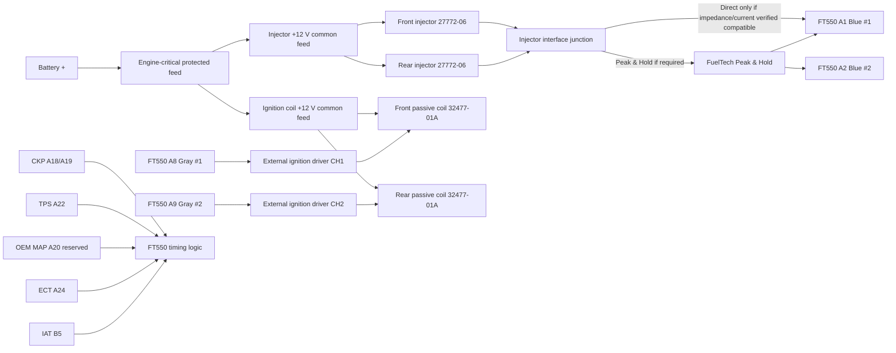

# Sheet 03 - Injection and Ignition

## Purpose

Define the new engine-critical actuator wiring around the FT550 while retaining the original VRXSE engine hardware.

## Manufacturer-verified FT550 output cavities

| FT550 cavity | Wire | Manufacturer function | Turbo V-Rod project allocation |
|---|---|---|---|
| A1 | Blue #1 | Injection output #1 - Fuel Primary | Front injector command |
| A2 | Blue #2 | Injection output #2 - Fuel Primary | Rear injector command |
| A8 | Gray #1 | Ignition output #1 | External ignition-driver channel 1 command |
| A9 | Gray #2 | Ignition output #2 | External ignition-driver channel 2 command |

These cavity assignments are frozen.

## Engine-critical power philosophy

Injector and ignition +12 V feeds remain on the dedicated EPM branch. FT550 command outputs remain direct ECU command paths, but passive ignition-coil primary current is switched by a dedicated external igniter rather than by the FT550 gray outputs.

## Injector circuits

OEM Destroyer high-flow injectors are Harley 27772-06, supplied as kit 27791-05. Harley specifies a Race Tuner flow calibration of 6.37 g/s and states the kit flows approximately 30 percent more fuel than standard VRSC injectors.

| Circuit | Supply | FT550 command | Interface status |
|---|---|---|---|
| Front injector | EPM protected +12 V | A1 Blue #1 | Direct only if impedance/current meets FuelTech limits; otherwise Peak & Hold |
| Rear injector | EPM protected +12 V | A2 Blue #2 | Direct only if impedance/current meets FuelTech limits; otherwise Peak & Hold |

FuelTech specifies that blue injector outputs may directly drive injectors within their permitted impedance/load limits, and requires Peak & Hold for low-impedance injectors below 7 ohms or when the output loading exceeds those limits.

### Harness decision

Add an injector interface junction so the engine-side injector loom does not need to be rebuilt if a Peak & Hold module is required after measurement.

Before energisation, close HC-008/HC-009 and record injector resistance, current behaviour, connector cavities and final interface mode.

## Ignition circuits

The OEM ignition baseline is Harley 32477-01A plug-top coils.

Physical evidence shows 32477-01A uses a two-terminal primary connector. The project therefore classifies this coil as a **passive/dumb coil** rather than a conventional smart coil requiring separate +12 V, ground and logic-trigger terminals.

FuelTech explicitly requires an external igniter for dumb/passive coils and states the FT gray ignition outputs must not be connected directly to dumb coils.

| Circuit | Coil supply | FT550 command | Frozen interface |
|---|---|---|---|
| Front coil | EPM protected +12 V | A8 Gray #1 | A8 -> external igniter CH1 -> front 32477-01A coil |
| Rear coil | EPM protected +12 V | A9 Gray #2 | A9 -> external igniter CH2 -> rear 32477-01A coil |

### External ignition driver

Project baseline: a FuelTech-compatible two-channel inductive ignition driver, with SparkPRO-2 or equivalently verified FuelTech-supported hardware.

The external-driver topology is frozen. Exact dwell, current limit and driver part number remain verification-gated until the OEM coil electrical characteristics are closed.

## Grounding and routing

External ignition-driver power ground must terminate at the engine/power ground structure specified by the driver manufacturer, not the FT550 precision sensor ground. Coil and injector current returns must not contaminate the sensor-ground network.

Route A8/A9 command wiring and CKP separately from high-current coil-primary and starter conductors. Preserve the OEM mechanical/secondary ground path and verify engine-to-battery-negative resistance.

## Trigger dependency

No OEM cam sensor is currently identified. Final injection and ignition phasing remains dependent on the verified crank-trigger configuration and chosen crank-only/semi-sequential strategy. Validate CKP polarity, stable cranking RPM and commanded-versus-mechanical timing before enabling load operation.

## Release state

**FT550 output cavities: FROZEN.**

**Ignition driver topology: FROZEN as external igniter for passive 32477-01A coils.**

Still open before final release:

- injector impedance/current class and Peak & Hold requirement;
- coil primary resistance/current ramp and final dwell calibration;
- exact external igniter part number/connectors;
- OEM injector/coil terminal identification;
- final EPM conductor/protection sizing.
