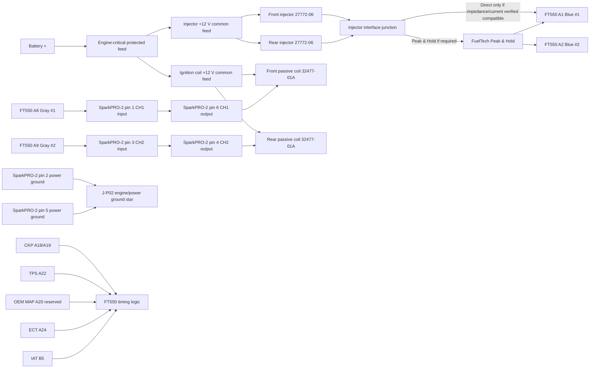

# Sheet 03 - Injection and Ignition

## Purpose

Define the new engine-critical actuator wiring around the FT550 while retaining the original VRXSE engine hardware.

## Manufacturer-verified FT550 output cavities

| FT550 cavity | Wire | Manufacturer function | Turbo V-Rod project allocation |
|---|---|---|---|
| A1 | Blue #1 | Injection output #1 - Fuel Primary | Front injector command |
| A2 | Blue #2 | Injection output #2 - Fuel Primary | Rear injector command |
| A8 | Gray #1 | Ignition output #1 | SparkPRO-2 channel 1 input |
| A9 | Gray #2 | Ignition output #2 | SparkPRO-2 channel 2 input |

These cavity assignments are frozen.

## SparkPRO-2 pin-level ignition interface

FuelTech SparkPRO manual v2.2 defines the SparkPRO-2 six-pin connector from the rear/wire side of the connector. The project pin allocation is:

| SparkPRO-2 pin | Manufacturer function | Wire class | Project connection |
|---|---|---:|---|
| 1 | Channel input 1 | 0.5 mm2 | FT550 A8 Gray #1 |
| 2 | Power ground | 1.0 mm2 | J-P02 engine/power ground star |
| 3 | Channel input 2 | 0.5 mm2 | FT550 A9 Gray #2 |
| 4 | Channel output 2 | 1.0 mm2 | Rear 32477-01A switched primary |
| 5 | Power ground | 1.0 mm2 | J-P02 engine/power ground star |
| 6 | Channel output 1 | 1.0 mm2 | Front 32477-01A switched primary |

**Connector orientation rule:** identify SparkPRO pins while viewing the rear/wire-entry side exactly as shown in the FuelTech manual. Do not mirror the pin numbers from a front-face view.

Both SparkPRO power-ground conductors are mandatory and terminate in the EPM power-ground structure, not the FT550 sensor-ground network.

## Engine-critical power philosophy

Injector and ignition +12 V feeds remain on the dedicated EPM branch. FT550 command outputs remain direct ECU command paths, but passive ignition-coil primary current is switched by SparkPRO-2 rather than by the FT550 gray outputs.

## Injector circuits

OEM Destroyer high-flow injectors are Harley 27772-06, supplied as kit 27791-05. Harley specifies a Race Tuner flow calibration of 6.37 g/s and states the kit flows approximately 30 percent more fuel than standard VRSC injectors.

| Circuit | Supply | FT550 command | Interface status |
|---|---|---|---|
| Front injector | EPM protected +12 V | A1 Blue #1 | Direct only if impedance/current meets FuelTech limits; otherwise Peak & Hold |
| Rear injector | EPM protected +12 V | A2 Blue #2 | Direct only if impedance/current meets FuelTech limits; otherwise Peak & Hold |

FuelTech specifies that blue injector outputs may directly drive injectors within their permitted impedance/load limits, and requires Peak & Hold for low-impedance injectors below 7 ohms or when the output loading exceeds those limits.

### Harness decision

Add an injector interface junction so the engine-side injector loom does not need to be rebuilt if a Peak & Hold module is required after measurement.

Before energisation, close HC-008/HC-009 and record injector resistance, current behaviour, connector cavities and final interface mode.

## Ignition circuits

The OEM ignition baseline is Harley 32477-01A plug-top coils. The project classifies them as passive two-terminal coils and uses SparkPRO-2 as the mandatory ignition-current driver.

| Circuit | Coil supply | FT550 command | SparkPRO-2 path |
|---|---|---|---|
| Front coil | EPM protected +12 V | A8 Gray #1 | pin 1 input -> pin 6 output -> front coil |
| Rear coil | EPM protected +12 V | A9 Gray #2 | pin 3 input -> pin 4 output -> rear coil |

SparkPRO-2 pin 2 and pin 5 each use 1.0 mm2 power-ground conductors to J-P02. The two ground paths are not to be merged into a smaller single conductor upstream of the module.

FuelTech SparkPRO is a dwell-controlled falling-edge ignition driver. Final dwell remains measurement/calibration-gated for the OEM coil and is not inferred from generic FuelTech examples.

## Grounding and routing

SparkPRO-2 grounds terminate at the engine/power ground structure, not the FT550 precision sensor ground. Coil and injector current returns must not contaminate the sensor-ground network.

Route A8/A9 command wiring and CKP separately from SparkPRO output wiring, coil primary conductors and starter cables. SparkPRO output leads should be kept short. Preserve the OEM mechanical/secondary ground path and verify engine-to-battery-negative resistance.

## Trigger dependency

No OEM cam sensor is currently identified. Final injection and ignition phasing remains dependent on the verified crank-trigger configuration and chosen crank-only/semi-sequential strategy. Validate CKP polarity, stable cranking RPM and commanded-versus-mechanical timing before enabling load operation.

## Release state

**FT550 output cavities: FROZEN.**

**SparkPRO-2 hardware: FROZEN.**

**SparkPRO-2 six-pin ignition harness: FROZEN at manufacturer pin level.**

Still open before final release:

- injector impedance/current class and Peak & Hold requirement;
- coil primary resistance/current ramp and final dwell calibration;
- exact SparkPRO mating housing/terminal/seal part numbers if not supplied as a FuelTech harness;
- OEM injector/coil mating terminal identification;
- final EPM branch lengths and protection sizing.
