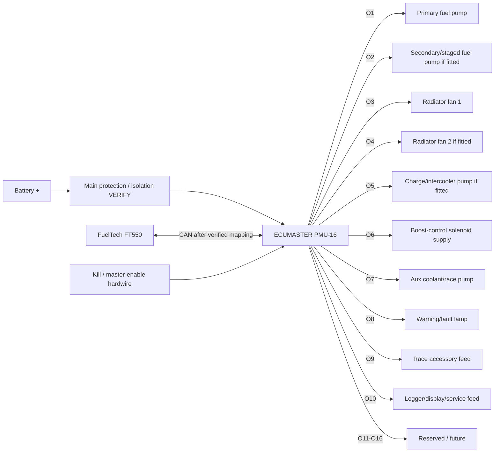

# Sheet 04 - ECUMASTER PMU-16 Power Distribution

## Role

The PMU-16 is the new high-current auxiliary power-distribution backbone. It replaces conventional relay/fuse branches for non-precision loads while adding current measurement and programmable protection.

## Proposed output allocation

| PMU output | Load | Control concept | Failure action | Status |
|---|---|---|---|---|
| O1 | Primary fuel pump | FT550 request or PMU engine-running logic | engine shutdown / fuel cut strategy required | DESIGN, current limit VERIFY |
| O2 | Secondary fuel pump | staged by boost/RPM/load request | boost/load reduction or shutdown | DESIGN, only if fitted |
| O3 | Radiator fan 1 | ECT threshold / override | warning + temperature protection | DESIGN |
| O4 | Radiator fan 2 | ECT threshold / staged | warning + temperature protection | DESIGN, if fitted |
| O5 | Charge/intercooler pump | ignition/engine run | warning / boost restriction | DESIGN, if fitted |
| O6 | Boost-control solenoid +12 V | enabled with engine-control state; low-side/PWM control strategy VERIFY | default to mechanical/base boost | DESIGN |
| O7 | Auxiliary coolant/race pump | application-specific | application-specific | RESERVED |
| O8 | Warning/fault lamp | PMU/FT550 fault logic | driver indication | DESIGN |
| O9 | Race accessory | switched | isolate on fault | RESERVED |
| O10 | Logger/display/service feed | ignition switched | non-engine-critical | DESIGN |
| O11-O16 | spare | none | off | RESERVED |

## PMU input concept

Use PMU A1-A16 only for power-system commands/status that do not contaminate or duplicate the FT550 precision sensor network. Candidate inputs include master enable, start request, kill request, fan override and service/test mode. Exact A-input assignments remain `VERIFY` until the PMU pinout is frozen into the harness schedule.

## CAN philosophy

CAN between FT550 and PMU is desirable for status and command exchange, but no CAN identifier or payload is defined in this repository yet. Do not invent messages. Critical safe states must exist without CAN:

- loss of CAN must not latch boost control in a high-boost state;
- fuel-pump behaviour must be explicitly defined;
- cooling defaults must be safe;
- kill/master isolation remains hardwired.

## Protection setup

For every populated output, measure and record steady current and inrush on the actual component. Then configure soft/current limits, trip threshold, retry timing and retry count from the ECUMASTER manual. Do not choose limits from generic load estimates.
