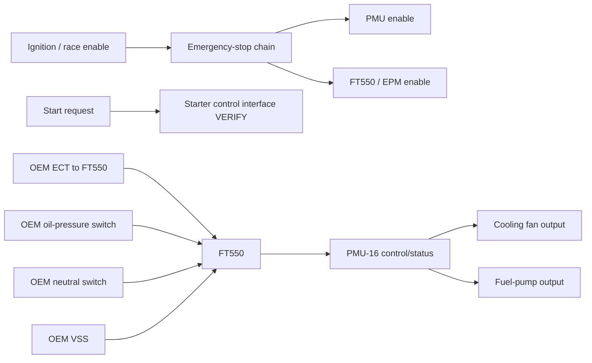

# Sheet 05 - Start, Kill, Cooling and Auxiliary Control

## Purpose

Define the remaining vehicle-control interfaces around the new FT550 and PMU-16 harness while retaining OEM switches and starter/cooling hardware where practical.

## Emergency stop

The emergency-stop chain must remove engine-control enable and command the power-distribution system to a documented safe state. A software-only or CAN-only emergency stop is not accepted for this revision.

## Starter circuit

Retain the OEM starter motor and conventional high-current starter contactor architecture unless a future revision explicitly changes it. The PMU may supervise a low-current starter-control interface only after input/output suitability is verified against the exact PMU documentation and physical hardware.

## Cooling

The OEM ECT remains the temperature source for the FT550. PMU outputs are assigned to cooling-fan power after actual fan current and inrush are measured. Final output numbers and protection settings remain `VERIFY` until that measurement is complete.

## Fuel pump control

The PMU provides protected fuel-pump power. The control logic must include a short prime state and an engine-running state, with a defined safe state when engine operation is not detected. Exact command transport between FT550 and PMU remains `VERIFY` until the CAN/hardwire strategy is validated.

## OEM switch hardware

The OEM oil-pressure switch and neutral switch are retained and terminated to verified FT550 digital inputs. Their electrical polarity and pull-up strategy remain `VERIFY` before first energisation.

## Charging system

The alternator/stator/regulator and charging-system branch is not yet fully defined by repository data. It remains a dedicated `VERIFY` item and must be added before the harness is released as production-complete.
